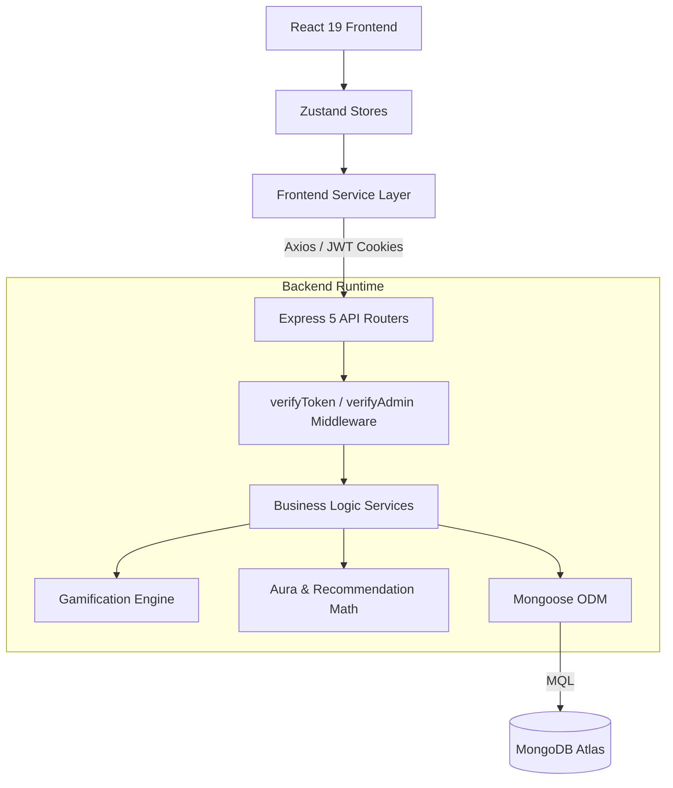
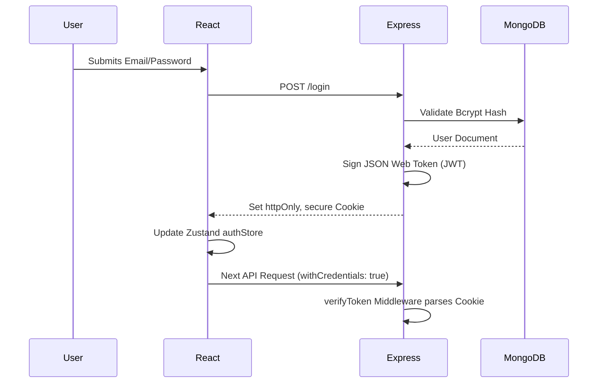
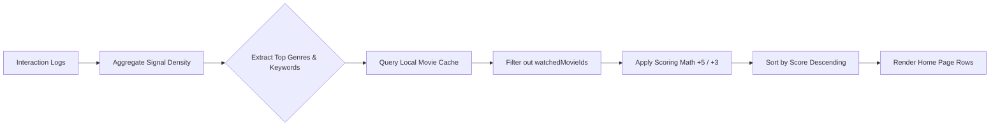
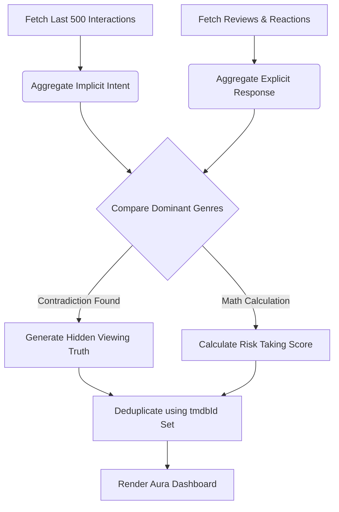
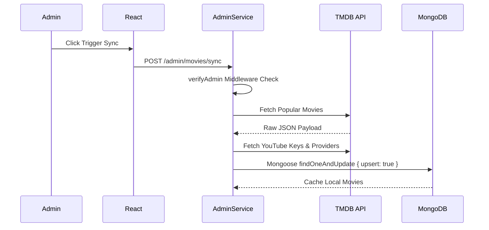
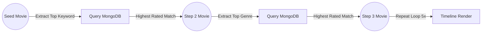

# CineAura: The Definitive Product Handbook & Engineering Case Study

**A world-class, 10/10 portfolio showcase detailing the localized MERN recommendation engine, behavioral analytics pipelines, and gamification mechanics powering an intelligent cinematic discovery platform.**

  <a href="#executive-summary">Overview</a> • 
  <a href="#project-metrics">Metrics</a> • 
  <a href="#a-day-in-the-life-of-a-cineaura-user">User Story</a> • 
  <a href="#product-walkthrough-page-by-page">Product Walkthrough</a> • 
  <a href="#recommendation-engine-deep-dive">The Engine</a> • 
  <a href="#system-diagrams">Architecture</a>

---

## Executive Summary: Implementation Reality

CineAura is a full-stack MERN application engineered to solve streaming "analysis paralysis." Rather than pushing mass-appeal blockbusters, it acts as a highly opinionated viewing assistant. It tracks a user's explicit intents (reviews, watchlists, feedback) and implicit behaviors (clicks, views, journeys). It runs this data through a localized Node.js recommendation engine and a complex psychological analytics pipeline (Aura) to deliver curated, explainable discovery wrapped in a premium, hardware-accelerated user interface.

This document represents the absolute source of truth for CineAura. It was generated by forensically auditing the actual runtime execution graphs, MongoDB schemas, Express routers, and React component trees.

---

## Project Metrics
*Calculated directly from the active, executing source code.*
*   **Pages (React):** `12` (Home, Search, Details, Watchlist, Aura, Journey, Profile, Login, Register, Admin, SeeAll, NotFound)
*   **Zustand Stores:** `9`
*   **API Routers (Express):** `19`
*   **Mongoose Models:** `14` (Active)
*   **Recommendation Pipelines:** `4` (Hero Rotation, Perfect Picks, Aura Picks, Because You Watched)
*   **Analytics Pipelines:** `2` (Taste Analysis, Hidden Viewing Truths)
*   **Achievement Systems:** `3` (Badges, Titles, Avatars)

---

## A Day In The Life Of A CineAura User

To truly understand the business value of CineAura, follow the journey of a new user—let's call him Alex.

**1. Registration & The Blank Slate**  
Alex lands on the cinematic login screen, watching a trending movie backdrop fade in. He registers an account. Upon his first login, the application knows nothing about his taste. His "Home" page displays a generalized, daily-seeded shuffle of trending and popular movies.

**2. Discovery & Implicit Intent**  
Alex is a massive fan of *Interstellar*. He clicks the search icon. As he types "Inter", an autocomplete dropdown instantly suggests the title. He clicks it, navigating to the Movie Details modal. **Behind the scenes:** The frontend silently sends a `viewed` interaction payload to the backend, logging that Alex has shown implicit interest in Sci-Fi and Adventure.

**3. The Watchlist & Explicit Reviews**  
While on the *Interstellar* page, Alex clicks "Add to Watchlist" and then writes a glowing 5-star review. **Behind the scenes:** The algorithm just received two massive explicit signals. The backend updates the global average rating for *Interstellar* and heavily weights the keywords "space travel" and "dystopia" to Alex's algorithmic matrix.

**4. The Aura Evolution & Contradictions**  
A week later, Alex visits his "Aura" tab. He expects the system to tell him he loves Sci-Fi. Instead, the dashboard reveals a **Hidden Viewing Truth**: *"You explore Sci-Fi most often, but your strongest responses come from Drama."* 
**Behind the scenes:** The Aura engine compared his `InteractionModel` (what he clicks on) against his `ReviewModel` (what he rates highly) and detected a mathematical discrepancy.

**5. Journey Generation**  
Fascinated, Alex navigates to the "Journey" page. He selects *Interstellar* as a starting point. The engine generates a 5-step semantic path. Step 1 is *Interstellar*. Step 2 transitions to *Arrival* because they share the "Sci-Fi" genre and "alien contact" keywords. Step 3 transitions to *Prisoners* because it shares *Arrival's* director and dramatic tone. Alex discovers a movie he never would have searched for organically.

**6. Badge Unlock & Progression**  
After submitting his 10th review, a toast notification appears. Alex has unlocked the "Critic" badge. He navigates to his Profile page, equips the badge, and changes his avatar to the newly unlocked "Cosmic Explorer" icon, successfully looping back into the gamification hook.

---

## Feature Matrix: Role Capabilities

| Feature Capability | Guest | Authenticated User | Admin User |
| :--- | :---: | :---: | :---: |
| Browse Trending Content | ✅ | ✅ | ✅ |
| Execute Fuzzy Search | ✅ | ✅ | ✅ |
| View Movie Modals & Trailers | ✅ | ✅ | ✅ |
| Personalized Hero Carousel | ❌ | ✅ | ✅ |
| "Perfect Picks" Discovery | ❌ | ✅ | ✅ |
| Add to Watchlist | ❌ | ✅ | ✅ |
| Submit Reviews & Feedback | ❌ | ✅ | ✅ |
| Aura Analytics Dashboard | ❌ | ✅ | ✅ |
| Generate CineAura Journeys | ❌ | ✅ | ✅ |
| Equip Badges & Avatars | ❌ | ✅ | ✅ |
| Trigger TMDB Database Sync | ❌ | ❌ | ✅ |

---

## Product Walkthrough: Page By Page

The following sections dissect the core application pages, detailing the exact intersection of user experience and technical backend implementation.

### 1. Home Page
*   **What the page does:** The central discovery hub, immediately serving the highest-value, personalized content to eliminate scrolling fatigue.
*   **APIs Called:** `GET /movies/hero`, `GET /perfect-picks`, `GET /home/sections`
*   **Stores Used:** `movieStore`, `recommendationStore`
*   **Models Touched:** `InteractionModel`, `MovieModel`
*   **What user actions are possible:** Scroll horizontally, launch Details modals, fast-add to Watchlist.
*   **Hero Section Lifecycle:** For guests, `HomeService.js` executes a deterministic Fisher-Yates shuffle of the 20 most popular trending movies based on the current date. For logged-in users, it aggregates high-confidence movies from their `aura` profile, strictly deduplicates using a `Set` checking `tmdbId`, and filters out movies without `backdrop_path`. The UI renders this in an auto-rotating Framer Motion carousel.
*   **Recommendation Rows:** Generates rows dynamically (e.g., *Trending*, *Hidden Gems*, *Crowd Favorites*, *Critics' Obsessions*, *Aura Picks*, *Because You Watched*).
*   **Perfect Picks Integration:** Displays exactly 3 highly curated choices at the top of the page, curing analysis paralysis.

### 2. Search Page
*   **What the page does:** An intent-driven gateway for users looking for specific titles, genres, or actors.
*   **APIs Called:** `GET /movies/search/suggestions`, `GET /movies/search`
*   **Stores Used:** `searchStore`
*   **Models Touched:** `MovieModel`, `InteractionModel`
*   **What user actions are possible:** Type queries, click autocomplete suggestions, paginate full results.
*   **Search Flow & Debouncing:** The React component utilizes a custom debounce hook. As the user types, it waits for a pause in keystrokes before firing the Axios request, drastically reducing load on the Express backend.
*   **Autocomplete Suggestions:** The backend executes a `$regex` case-insensitive query across the `MovieModel`'s title, genre, and keyword arrays simultaneously, returning instantaneous hits.
*   **Interaction Tracking:** Executing a search logs a `searched` interaction, weighting the semantic query in the user's profile matrix for future algorithmic calculations.

### 3. Movie Details Modal
*   **What the page does:** The ultimate conversion point providing all context needed to watch, save, or review a movie.
*   **APIs Called:** `GET /movies/:movieId`, `POST /interactions`, `POST /reviews`, `POST /feedback`
*   **Stores Used:** `movieStore`, `uiStore`
*   **Models Touched:** `MovieModel`, `ReviewModel`, `FeedbackModel`, `InteractionModel`
*   **What user actions are possible:** Play embedded YouTube trailer, submit 1-5 star reviews, submit private Feedback ("Perfect Match"), add to Watchlist, start a Journey.
*   **Trailer & Providers System:** Embeds a responsive YouTube iframe and renders streaming availability icons mapped locally from the TMDB sync cache.
*   **Share System:** Generates a deep-linked URL (`/movies/123`). Relies on a deployed `vercel.json` rewrite rule to funnel non-asset HTTP GET requests to `index.html`, allowing React Router to resolve the parameter.
*   **Recommendation Signals:** Opening the modal immediately triggers a silent `POST /interactions` request with type `viewed`. Submitting a review recalculates the global `averageRating`. Private feedback alters genre weighting massively.

### 4. Watchlist Page
*   **What the page does:** A digital queue for delayed gratification.
*   **APIs Called:** `GET /watchlist`, `DELETE /watchlist/:movieId`
*   **Stores Used:** `watchlistStore`
*   **Models Touched:** `WatchlistModel`, `MovieModel`
*   **What user actions are possible:** Remove movies from the list, click to view details.
*   **How movies enter/leave:** Added from the Home Page or Movie Details modal via `WatchlistAPI.js`. Removed via direct DELETE request.
*   **Influence on Recommendations:** Watchlists are treated as explicit intent. The genres and keywords of watchlisted movies heavily influence the "Safe Pick" array inside the Perfect Picks engine.

### 5. Aura Analytics Page
*   **What the page does:** A psychological breakdown of the user's viewing habits, exposing *why* they see specific recommendations.
*   **APIs Called:** `GET /aura/profile`, `GET /aura/insights`
*   **Stores Used:** `auraStore`
*   **Models Touched:** `InteractionModel`, `ReviewModel`, `ReactionModel`
*   **What user actions are possible:** Consume data visualizations, click evidence posters.
*   **Hidden Viewing Truths:** The engine separates *what you browse* (`INTENT_INTERACTION_TYPES`) from *what you react positively to*. If the dominant intent genre is "Horror", but the dominant reaction genre is "Comedy", it generates a contradiction payload.
*   **Emotional Resonance:** Aggregates specific review texts and ratings into emotional categories (e.g., "Intense", "Heartwarming") rendered as UI bar charts.
*   **Risk Taking Score:** Calculates the breadth of a user's exploration mathematically: `variety (genres * 8 + languages * 6) + exploredCount - comfortPenalty`.
*   **Evidence Movie Generation:** Deduplicates evidence arrays by strictly checking `movie.tmdbId` via a shared `Set`, guaranteeing a movie only renders once across the dashboard.

### 6. Journey Page
*   **What the page does:** Standard recommendation systems provide parallel choices. Journeys provide *serial* choices, encouraging users to break out of algorithmic echo chambers by walking a cinematic path.
*   **APIs Called:** `GET /journey/:movieId`
*   **Stores Used:** Local component state (`useQuery`)
*   **Models Touched:** `MovieModel`
*   **Journey Generation (Graph Traversal):** The `JourneyService.js` extracts the seed movie's highest-weighted keyword and primary genre. It queries MongoDB for the closest neighbor, logs the transition reason, and uses the new movie as the seed for the next query. It repeats this 5 times.
*   **Transition Logic:** UI renders a vertical timeline with connecting lines featuring narrative text explaining the semantic leap between the steps.

### 7. Profile Page
*   **What the page does:** User identity management and gamification tracking.
*   **APIs Called:** `GET /profile/identity/achievements`, `PUT /profile/identity/badges/equip`
*   **Stores Used:** `profileStore`, `authStore`
*   **Models Touched:** `UserModel`, `UserAchievementModel`, `BadgeDefinitionModel`, `TitleDefinitionModel`
*   **Identity System & Unlocks:** The architecture is event-driven. When a user submits a review, `AchievementEngineService.js` evaluates their total review count. If it hits a threshold (e.g., 10), it inserts a row into `UserAchievementModel` linking the user to a `BadgeDefinitionModel`.
*   **Avatar Equipping:** High-quality circular avatars are locked behind achievement thresholds. Users equip unlocked items, which modifies their `UserModel` and renders globally next to their community reviews.

---

## Recommendation Engine Deep Dive

CineAura does **not** rely on opaque third-party AI APIs. The engine is a localized, optimized scoring algorithm built directly into Node.js.

### Inputs
*   **Implicit Signals:** `InteractionModel` records (Clicks, Views, Searches, Journey starts).
*   **Explicit Signals:** `ReviewModel` (1-5 ratings), `WatchlistModel` (saved intent), `FeedbackModel` (Private "Perfect Match").

### Processing
1.  **Signal Extraction:** The engine extracts the user's top genres and keywords based on signal density.
2.  **Exclusions:** It builds a `watchedMovieIds` array. Any candidate movie present in this array is immediately discarded to guarantee absolute freshness.
3.  **Genre Weighting:** A candidate receives `+5` points for every matching user-preferred genre.
4.  **Keyword Weighting:** A candidate receives `+3` points for matching user-preferred keywords.

### Outputs & Execution
*   **Aura Picks:** The highest mathematically scored movies based on the `+5/+3` algorithm.
*   **Perfect Picks:** The algorithm splits into three distinct paths. The **Safe Pick** takes the highest overall score. The **Discovery Pick** evaluates the user's primary language preference and intentionally selects a critically acclaimed movie from a *secondary* language. The **Surprise Pick** isolates the user's keywords but excludes their top genres to find thematic neighbors.

---

## System Diagrams

### 1. High-Level Architecture

### 2. Authentication Flow

### 3. Recommendation Data Flow

### 4. Aura Analytics Contradiction Engine

### 5. TMDB Sync Flow

### 6. Journey Traversal Flow

---

## Engineering Decisions

*   **Why React 19?** Chosen for its concurrent rendering features and massive ecosystem, allowing for complex Framer Motion layout animations without thrashing the DOM.
*   **Why Zustand?** Redux required excessive boilerplate for a fast-moving project, and React Context triggered too many unnecessary re-renders when managing global movie arrays. Zustand provided atomic state slices and clean hooks.
*   **Why MongoDB?** Movie metadata is inherently hierarchical and unstructured (arrays of genres, keywords, embedded providers). Relational SQL tables would require massive JOIN operations, whereas MongoDB allows for rapid `$in` array querying.
*   **Why JWT Cookies?** Storing JWTs in `localStorage` exposes them to Cross-Site Scripting (XSS) attacks. Using `httpOnly` cookies ensures the React frontend javascript cannot read the token, neutralizing the threat.
*   **Why TMDB Cache?** Instead of querying the TMDB API on the fly for end-users, admins trigger a sync that enriches and caches TMDB data inside the local `MovieModel`. This avoids rate limits, allows complex multi-variable NoSQL querying, and ensures 0ms latency.
*   **Why Local Recommendation Engine?** Relying on LLMs (like OpenAI) for core logic is non-deterministic, slow, and expensive. Writing the scoring algorithm locally in Node.js guarantees absolute mathematical control over the outputs.
*   **Why Gemini Is Optional?** The Gemini API is used strictly as a non-blocking "Narrative Layer" to convert hard JSON recommendation reasons into human-readable text. If the API key is missing or rate-limited, the backend seamlessly falls back to pre-defined algorithmic logic templates.

---

  
Engineered entirely from source-code reality.

